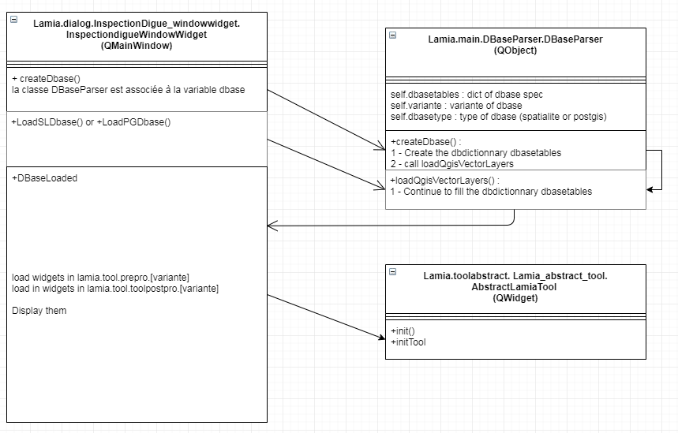

.. toctree::
    :maxdepth: 2

Developpement
=============

Fonctionnement général
----------------------

Le code repose principalement sur trois classes.

*   La classe « Lamia.dialog.InspectionDigue_windowwidget.InspectiondigueWindowWidget », qui est chargée au démarrage. Il s’agit du QDockWidget apparaissant au click sur l’icone Lamia dans l’interface QGis. 

*   La classe « Lamia.main.DBaseParser.DBaseParser ». Il s’agit d’un QObject chargé de l’ensemble des intéractions avec la base de données.

*   La classe « Lamia.toolabstract. Lamia_abstract_tool. AbstractLamiaTool » qui est un widget abstrait dont héritent tous les widgets apparaissant sur l’écran « propriétés ».

L’activité lors de l’ouverture de la base de données est schématisée ci-dessous :

|100000000000035B00000225B974C2810960DA56_png|
 *InspectiondigueWindowWidget*  est créé lors de l’ouverture de Lamia. Au chargement/création de la base de données, la classe DBaseParser est créée en variable  *d’InspectiondigueWindowWidget*  et cette classe se charge de la création et de la lecture de la base de données.

Ensuite, * InspectiondigueWindowWidget.DBaseLoaded*  charge l’ensemble des widgets (tous héritant de AbstractLamiaTool) apparaissant dans l’écran en bas à droite du  *InspectiondigueWindowWidget* .

Ainsi, le code est structuré de la façon suivante :

+------------------+------------------------------------------------------------------------------------------------------------------------------------------------------+
|  **Dossier**     |  **Contenu**                                                                                                                                         |
|                  |                                                                                                                                                      |
+------------------+------------------------------------------------------------------------------------------------------------------------------------------------------+
| +---dialog       | Contient les fichiers sources des interfaces graphiques des boites de dialogues de LAMIA ainsi que les codes python pour les gérer.                  |
|                  |                                                                                                                                                      |
|                  |                                                                                                                                                      |
|                  | Il contient notamment InspectiondigueWindowWidget .                                                                                                  |
|                  |                                                                                                                                                      |
+------------------+------------------------------------------------------------------------------------------------------------------------------------------------------+
| +---main         | Contient le main de LAMIA qui importe le DBaseParser et le DBaseParser qui initialise l'environnement LAMIA.                                         |
|                  |                                                                                                                                                      |
|                  |                                                                                                                                                      |
+------------------+------------------------------------------------------------------------------------------------------------------------------------------------------+
| +---toolabstract | Contient Lamia_abstract_tool.py qui est la classe abstraite dont héritent tous les widgets présents en bas à droite de InspectiondigueWindowWidget . |
|                  |                                                                                                                                                      |
+------------------+------------------------------------------------------------------------------------------------------------------------------------------------------+

Les éléments propres à la création et à la manipulation de la base de données sont ici :

+-----------------+------------------------------------------------------------------------------------------------------------+
|  **Dossier**    |  **Contenu**                                                                                               |
|                 |                                                                                                            |
+-----------------+------------------------------------------------------------------------------------------------------------+
| +---DBASE       | Dossier contenant tous les éléments nécessaires à la création des bases de données                         |
|                 |                                                                                                            |
+-----------------+------------------------------------------------------------------------------------------------------------+
| |               | Dossier contenant les bordereaux de prix permettant le chiffrage automatique des travaux                   |
|                 |                                                                                                            |
| +---BPU         |                                                                                                            |
|                 |                                                                                                            |
+-----------------+------------------------------------------------------------------------------------------------------------+
| |               | Dossier contenant tous les fichiers excel embarquant la description des tables ainsi que les nomenclatures |
|                 |                                                                                                            |
| +---create      |                                                                                                            |
|                 |                                                                                                            |
+-----------------+------------------------------------------------------------------------------------------------------------+
| |               | Dossier contenant la base SQLITE utilisée pour amorcée la création des bases de données                    |
|                 |                                                                                                            |
| +---sqlite_base |                                                                                                            |
|                 |                                                                                                            |
+-----------------+------------------------------------------------------------------------------------------------------------+
| |               | Contient les feuilles de styles utilisées pour l'affichage de l'interface LAMIA                            |
|                 |                                                                                                            |
| +---style       |                                                                                                            |
|                 |                                                                                                            |
+-----------------+------------------------------------------------------------------------------------------------------------+
| |               | Contient des ressources d'affichage                                                                        |
|                 |                                                                                                            |
| \---utils       |                                                                                                            |
|                 |                                                                                                            |
+-----------------+------------------------------------------------------------------------------------------------------------+

Tous les widgets apparaissant en bas à droite d’ *InspectiondigueWindowWidget*  et héritant de AbstractLamiaTool sont stockés ici :

+-------------------+--------------------------------------------------------------------------------------------------------------------------+
|  **Dossier**      |  **Contenu**                                                                                                             |
|                   |                                                                                                                          |
+-------------------+--------------------------------------------------------------------------------------------------------------------------+
| +---toolpostpro   | Outils de post-production (synthèses, exports, rapports, …)                                                              |
|                   |                                                                                                                          |
+-------------------+--------------------------------------------------------------------------------------------------------------------------+
| |                 | Outils génériques d'import, d'export, de synthèse, de gestion des paths, de génération des rapports, d'étude de coûts, … |
|                   |                                                                                                                          |
| +---Base2         |                                                                                                                          |
|                   |                                                                                                                          |
+-------------------+--------------------------------------------------------------------------------------------------------------------------+
| |                 | Outils de post-traitement adaptés au métier.                                                                             |
|                   |                                                                                                                          |
| +---[Type métier] |                                                                                                                          |
|                   |                                                                                                                          |
+-------------------+--------------------------------------------------------------------------------------------------------------------------+
| \---toolprepro    | Interfaces graphiques et classes pythons permettant de manipuler la base de données                                      |
|                   |                                                                                                                          |
+-------------------+--------------------------------------------------------------------------------------------------------------------------+
| |                 | Outils génériques                                                                                                        |
|                   |                                                                                                                          |
| +---Base2         |                                                                                                                          |
|                   |                                                                                                                          |
+-------------------+--------------------------------------------------------------------------------------------------------------------------+
| |                 | Outils d’alimentation de la base de données adaptés au métier.                                                           |
|                   |                                                                                                                          |
| +---[Type métier] |                                                                                                                          |
|                   |                                                                                                                          |
+-------------------+--------------------------------------------------------------------------------------------------------------------------+

En plus de ces packages, les packages suivants sont également utilisés.

+-----------------------------+------------------------------------------------------------------------------------------------------------+
|  **Dossier**                |  **Contenu**                                                                                               |
|                             |                                                                                                            |
+-----------------------------+------------------------------------------------------------------------------------------------------------+
| +---config                  | Stock les données récemment utilisées à conserver en mémoire comme l'adresse des dernières bases utilisées |
|                             |                                                                                                            |
+-----------------------------+------------------------------------------------------------------------------------------------------------+
| +---gps                     | Contient les outils de connexion et d'exploitation des GPS                                                 |
|                             |                                                                                                            |
+-----------------------------+------------------------------------------------------------------------------------------------------------+
| +---html                    | Contient des outils de mise en page (js, css, images, polices, …)                                          |
|                             |                                                                                                            |
+-----------------------------+------------------------------------------------------------------------------------------------------------+
| +---icons                   | Contient les icones utilisés dans LAMIA                                                                    |
|                             |                                                                                                            |
+-----------------------------+------------------------------------------------------------------------------------------------------------+
| +---lamiautils              | Vide                                                                                                       |
|                             |                                                                                                            |
+-----------------------------+------------------------------------------------------------------------------------------------------------+
| +---libs                    | Continent certaines librairies embarquées directement dans LAMIA, souvent parce qu'elles ont été modifiées |
|                             |                                                                                                            |
+-----------------------------+------------------------------------------------------------------------------------------------------------+
| |                           | Librairie de connexion à une base NoSQL (lien avec SIRS Digues)                                            |
|                             |                                                                                                            |
| +---cloudant                |                                                                                                            |
|                             |                                                                                                            |
+-----------------------------+------------------------------------------------------------------------------------------------------------+
| |                           | Librairie de connexion à une base NoSQL (lien avec SIRS Digues)                                            |
|                             |                                                                                                            |
| +---cloudant_2_10           |                                                                                                            |
|                             |                                                                                                            |
+-----------------------------+------------------------------------------------------------------------------------------------------------+
| |                           | Librairie de génération de graphiques                                                                      |
|                             |                                                                                                            |
| +---pyqtgraph               |                                                                                                            |
|                             |                                                                                                            |
+-----------------------------+------------------------------------------------------------------------------------------------------------+
| |                           | Librairie de lecture de fichier Excel utilisée pour la création des bases de données                       |
|                             |                                                                                                            |
| \---xlrd                    |                                                                                                            |
|                             |                                                                                                            |
+-----------------------------+------------------------------------------------------------------------------------------------------------+
| +---maptool                 | Contient les éléments d'interaction avec la cartographie de Qgis                                           |
|                             |                                                                                                            |
+-----------------------------+------------------------------------------------------------------------------------------------------------+
| +---toolgeneral             | Contient des modules complémentaires pour LAMIA                                                            |
|                             |                                                                                                            |
+-----------------------------+------------------------------------------------------------------------------------------------------------+
| |                           | Permet de faire la passerelle depuis LAMIA vers SIRS Digues                                                |
|                             |                                                                                                            |
| +---LAMIA_to_SIRS           |                                                                                                            |
|                             |                                                                                                            |
+-----------------------------+------------------------------------------------------------------------------------------------------------+
| |                           | Permet de faire la passerelle depuis LAMIA vers SIRS Digues V1.7                                           |
|                             |                                                                                                            |
| +---LAMIA_to_SIRS_VCouch1_7 |                                                                                                            |
|                             |                                                                                                            |
+-----------------------------+------------------------------------------------------------------------------------------------------------+
| |                           | Permet de faire la passerelle depuis SIRS Digues vers LAMIA                                                |
|                             |                                                                                                            |
| +---SIRS_to_LAMIA           |                                                                                                            |
|                             |                                                                                                            |
+-----------------------------+------------------------------------------------------------------------------------------------------------+
| |                           | Permet de faire la passerelle depuis SIRS Digues vers                                                      |
|                             | LAMIA                                                                                                      |
| \---SIRS_to_LAMIA_VCouch1_7 |                                                                                                            |
|                             |                                                                                                            |
+-----------------------------+------------------------------------------------------------------------------------------------------------+

Installation de l’environnement de développement - windows
----------------------------------------------------------

Install de QGis
~~~~~~~~~~~~~~~
Il faut tout d’abord installer qgis à l’aide l’`installateur OSGEO <https://www.qgis.org/en/site/forusers/download.html>`_.

Choisir « Advanced install », et au dernier écran, choisir l’installation de :

*   Dans Desktop :

    *   qgis

    *   grass

*   Dans libs :

    *   python3-networkx

    *   python3-numpy

    *   python3-pillow

    *   python3-matplotlib

    *   python3-numpy

    *   python3-xlrd

Install de Pycharm
~~~~~~~~~~~~~~~~~~

Installer pycharm CE depuis leur `site internet <https://www.jetbrains.com/pycharm/download/#section=windows>`_.

Script pour démarrer PyCharm
~~~~~~~~~~~~~~~~~~~~~~~~~~~~

Afin de se faciliter la vie , il faut lancer pycharm avec le script suivant à mettre dans un .bat :

.. code-block::python

    @echo off
    REM Mettre ici le chemin vers l’install OSGEO
    SET OSGEO4W_ROOT=C:\OSGeo4W64

    REM adapter selon votre version de python et version de grass
    call "%OSGEO4W_ROOT%"\bin\o4w_env.bat
    call "%OSGEO4W_ROOT%"\apps\grass\grass-7.6.0\etc\env.bat
    @echo off
    path %PATH%;%OSGEO4W_ROOT%\apps\qgis-ltr\bin
    path %PATH%;%OSGEO4W_ROOT%\apps\grass\grass-7.6.0\lib
    path %PATH%;%OSGEO4W_ROOT%\apps\Qt5\bin
    set PYTHONPATH=%PYTHONPATH%;%OSGEO4W_ROOT%\apps\qgis-ltr\python;
    set PYTHONPATH=%PYTHONPATH%;%OSGEO4W_ROOT%\apps\Python37\lib\site-packages
    set QGIS_PREFIX_PATH=%OSGEO4W_ROOT%\apps\qgis
    SET QT_PLUGIN_PATH=%OSGEO4W_ROOT%\apps\Qt5\plugins
    SET QGIS_DISABLE_MESSAGE_HOOKS=1
    set PYTHONHOME=%OSGEO4W_ROOT%\apps\Python37

    REM A adapter selon votre install de Pycharm
    start "PyCharm aware of Quantum GIS" /B "C:\Program Files\JetBrains\PyCharm Community Edition 2019.1.2\bin\pycharm64.exe" %*

Configuration de PyCharm
~~~~~~~~~~~~~~~~~~~~~~~~

Installation sans gihub intéré à pycharm
^^^^^^^^^^^^^^^^^^^^^^^^^^^^^^^^^^^^^^^^

Créer un nouveau projet. Le chemin du projet doit pointer sur un répertoire contenant le clone github de `Lamia <https://github.com/Artelia/Lamia>`_. Ainsi, il sera créé un répertoire (Github p.ex), contenant un fichier __init__.py vide, et contenant un sous répertoire Lamia contenant le clone de github. 
Choisir l’interpréteur python en allant dans File/settings/Project/project interpreter et créer un interpreteur en pointant sur le PYTHONHOME défini dans le .bat de lancement de PyCharm.

Installation avec gihub intégré à pycharm, derrière un proxy
^^^^^^^^^^^^^^^^^^^^^^^^^^^^^^^^^^^^^^^^^^^^^^^^^^^^^^^^^^^^

Télécharger git et l’installer.

Dans pycharm\settings\Appearance\sysem settings\http proxy renseigner l’adresse et la port du proxy

Dans pycharm\settings\version control\git définir le répertoire où est installé git.exe

Dans pycharm\settings\version control\github ajouter votre compte github

Ensuite, créer un fichier .gitconfig dans votre répertoire « users » (c:/users/ « votre login ») avec dedans :

.. code-block:: python

    [user]
                   name = toto
                   email = toto.tata@mongroup.com
    [http]
                   proxy = http://XX.XX.XX.XX:XXXX

Enfin, lancer pycharm, aller dans VCS\get from version control… et choisir le projet github à cloner et le répertoire de destination

Test de la configuration
~~~~~~~~~~~~~~~~~~~~~~~~

Ouvrir le fichier Github/Lamia/test/00_test_main.py. 

Définir la variable path de la méthode testMethod vers un fichier lamia valide. 

Lancer le script.

Si tout se passe bien, Lamia se lance !!

faire fonctionner pip
~~~~~~~~~~~~~~~~~~~~~

Si pip ne marche pas, ouvrir le fichier OSGeo4W64\\apps\\Python37\\Scripts\pip3.exe, rechercher « c : » et remplacer le path à la suite par le bon path.

Cas pratique : création d’un nouveau module de post-traitement
--------------------------------------------------------------

Nous voulons créer un module de post-traitement pour le métier « éclairage ».

Dans ce cas, il faut créer un fichier test_module.py dans le répertoire lamia/toolpostpro/Base2_eclairage.

Ensuite, il convient de créer un widget avec QtDesigner et de l’enregistrer sous 'test_module.ui' dans le même répertoire.

Ce fichier aura la structure minimale suivante :

.. code-block:: python

    import os
    from ...toolabstract.Lamia_abstract_tool import AbstractLamiaTool
    from qgis.PyQt import uic
    from qgis.PyQt.QtWidgets import (QWidget)
        class CostTool(AbstractLamiaTool):
        TOOLNAME = 'test_module'
          def __init__(self, dbase, dialog=None, linkedtreewidget=None, gpsutil=None,parentwidget=None, parent=None):
            super(CostTool, self).__init__(dbase, dialog, linkedtreewidget, gpsutil,parentwidget, parent=parent)
          def initTool(self):
            # ****************************************************************************************
            # Main spec
            self.CAT = 'Synthese'
            self.NAME = 'Couts'
            self.visualmode = [4]

            self.groupBox_elements.setParent(None)
            self.frame_editing.setParent(None)

            def initFieldUI(self):
            if self.userwdgfield is None:
            self.userwdgfield = UserUI()

    class UserUI(QWidget):
        def __init__(self, parent=None):
            super(UserUI, self).__init__(parent=parent)
            # self.setupUi(self)
            uipath = os.path.join(os.path.dirname(__file__), 'test_module.ui')
            uic.loadUi(uipath, self)

