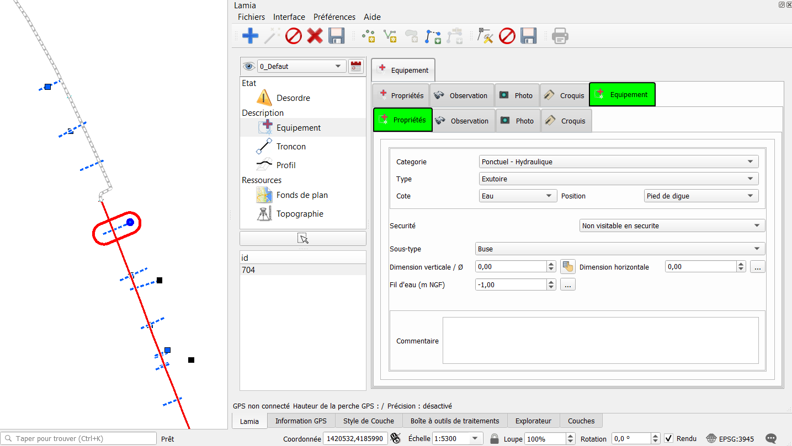
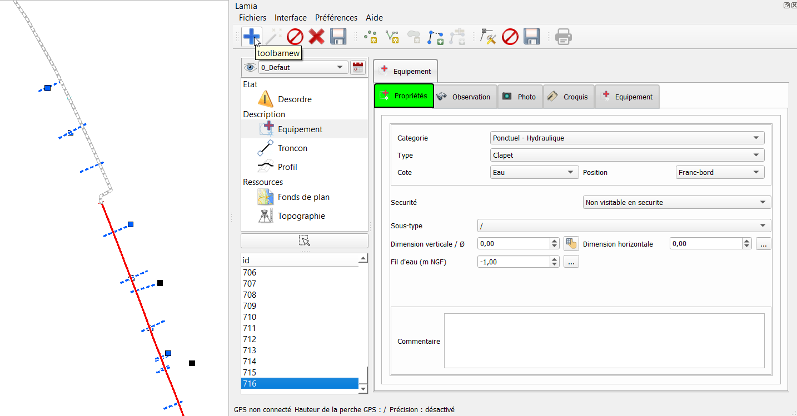
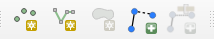
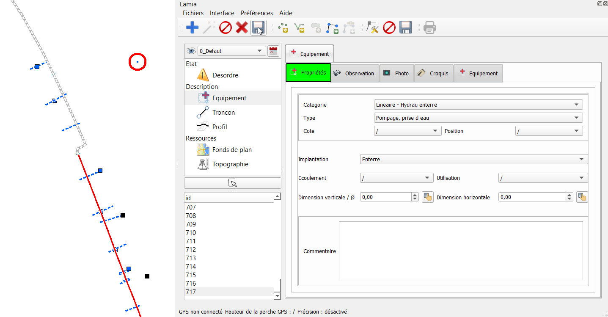

Prise en main rapide
##################################

Cette partie contient le minimum à savoir avant d’utiliser Lamia. Il est fortement conseillé de lire 
ce paragraphe.

Créer sa première base de données
==============================================

Au lancement de Qgis, la première étape est donc de démarrer LAMIA en cliquant sur l’icône 
du plugin.

.. image:: ./rawimages/quickstart/qs_01.png
    :width: 800px
    :align: center

Un nouveau panneau va s’ouvrir sur la droite de l’écran, qui contiendra le plugin.

.. image:: ./rawimages/quickstart/qs_02.png
    :width: 400px
    :align: center

Vous êtes ensuite prêt à créer votre première base de données. Pour cela, rendez-vous dans le 
menu FICHIERS/NOUVELLE BASE de LAMIA.

1. Une nouvelle boite de dialogue apparait alors.

.. image:: ./rawimages/quickstart/qs_03.png
    :width: 200px
    :align: center

Ici, sélectionnez :

* le type de base de données 

(par défaut, choisissez une base en spatialite, qui sera créée en local sur votre poste ou votre tablette) 

* le type de données à rentrer dans la base. 

Il s'agit du métier pour lequel vous voulez constituer une base de données. Les possibilités sont :

- les réseaux d'eau potable (choisir base3_waterdistribution)
- les réseaux d'assainissement (choisir base3_urbandrainage)
- les digues (choisir base3_levee)
- les relevés faune/flore (choisir base3_faunaflora)
- le suivi de chantier (choisir base3_constructionsite)

* La variante du métier à utiliser

Une variante  consiste en une interface adaptée à un besoin métier particulier ou à 
des exigeances clients particulières. Par defaut choisir Lamia.

2. Choix du système de coordonnées.

LAMIA vous demande alors de lui préciser le système de coordonnées qu’elle doit utiliser.

Nous vous conseillons d’utiliser un système de coordonnées classique. Dans le cas contraire, 
Qgis peut ne pas réussir à définir proprement les géométries et ne pas être capable de récupérer les 
informations que vous allez rentrer. Le Lambert 93 ici utilisé est une référence fiable (EPSG :2154)

3. Choix de l'espace de stockage

En spatialite, la boite de dialogue suivante vous demandera de choisir un emplacement où créer la 
base de données ainsi qu’un nom pour la base.

En Postgis, LAMIA vous demander les à la place les informations de connexion de la base avec laquelle 
elle doit travailler. Il faudra donc au préalable avoir construit ladite base (par exemple à travers 
l’interface pgadmin) et y avoir bien ajouté l’extension PostGIS.

LAMIA va alors construire la base de données. Cette étape peut prendre un peu de temps.

Par la suite, pour rouvrir la même base, vous pourrez utiliser le menu FICHIERS/CHARGER BASE 
et sélectionner la base spatialite précédemment créée ou renseigner les identifiants de la base PostGIS 
pour reprendre votre travail.

Découverte de l’interface
=========================================

Cette interface peut se décomposer en plusieurs parties :

1. Cartographie QGIS

Ce cadre contient l’ensemble des informations géographiques et l’interface SIG classique. 
Vous pouvez y traiter vos couches Qgis comme dans n’importe quel SIG et y placer directement 
vos géométries LAMIA par simple clic.

2. Module LAMIA

Le panneau du plugin LAMIA qui contient l’interface de saisie de données et de 
consultation des informations de la base.

3. Menu des objets principaux disponibles

Cette liste vous permet d’accéder aux différentes catégories d’objets disponibles dans votre base. 
Vous accédez ainsi aux différents types d’éléments pour consulter ceux déjà existants et en créer de 
nouveaux.

4. Liste des objets existants

Une fois un objet sélectionnée, vous trouvez ici la liste des objets déjà existants dans la base. 
Sélectionnez-en un ici  pour consulter les informations de cet objet.

5. Détails de l’objet, interface de saisie de données

Ce panneau affiche les informations sur les objets contenus dans la base. L’affichage dépend de la catégorie et s’adapte à chaque type 
d’objets pour détailler les différents paramètres. Vous pouvez initialiser ici les paramètres des objets 
que vous créez, consulter les données déjà existantes et les éditer.

6. Bouton de selection géographique

Ce bouton permet de selectionner depuis l'espace cartographique QGis (1) un objet du type selectionné
dans la liste des objets principaux (3)

**Point important à bien comprendre**

Un système d'onglet permet de naviguer entre les propriétés principales de l'objet et ses 
éléments enfant (ces éléments sont liés par un système de clés étrangères au sein de la base de données)

.. image:: ./rawimages/quickstart/qs_05.png
    :width: 600px
    :align: center

Dans l'exemple ci dessus, nous avons selectionné un équipement (en cliquant d'abord sur l'onglet 
Equipement dans le panneau 3, puis en selectionnant un objet avec le bouton 6).
Dans le formulaire (espace 5), les propriétés de cet objet apparaissent. Aussi, l'objet selectionné
est entouré de rouge dans l'espace cartographique (1)

Nous observons que d'autres onglets se situent à droite de l'onglet "Propriétés" : ce sont les tables liées 
à l'objet en cours de selection. Dans l'exemple ci-dessus, nous pouvons ainsi associer des observations, 
photos, croquis ou autre sous equipement à l'équipement selectionné.

Ainsi, si nous selectionnons l'onglet "Equipement" à droite de l'onglet "Propriétés", nous accedons aux équipements
liés à l'équipement principal préalalement selectionné. Cet élément "enfant" apparait entouré de bleu 
dans l'espace cartographique (1).

Une nouvelle ligne apparaît dans les onglets, avec la même logique que la ligne supérieure : les propriétés
de l'objet apparaissent dans l'onglet "Propriétés" et les tables enfants de cet objet apparaissent à droite
de l'onglet "Propriétés".

Ce principe deviendra plus clair avec la partie suivante où nous allons créer nos premiers objets Lamia.

C’est parti : première saisie
==========================================

La logique générale est toujours la même, et est expliquée ici.

.. note::  Il faudra toujours : 

    1. CRÉER

    2. SAISIR LA GÉOMÉTRIE ET RENSEIGNER LA FICHE

    3. ENREGISTRER

Le fait d'enregistrer à chaque changement est un choix fait qui permet d'assurer au final la qualité de
la donnée dans la base de données.

1. Tout d’abord, on choisit le type d’élément à renseigner, p.ex ici un équipement 

.. image:: ./rawimages/quickstart/qs_05.png
    :width: 600px
    :align: center

2. Ensuite on va créer un nouvel élément. Pour cela, dans la barre d'outil cliquer sur le "+" bleu :

un formulaire vierge apparaît, avec l'**onglet en rouge** pour signaler qu'il s'agit d'un nouvel enregistrement.

.. image:: ./rawimages/quickstart/qs_08.png
    :width: 500px
    :align: center

3. Naviguer dans le formulaire et renseigner les champs voulus.

4. Indiquer la localisation géographique de l'objet.

Pour cela, dans la barre d'outil présentée ci-dessus, cliquer sur le type de géometrie voulue 
(point, ligne ou polygon et saisir l'objet dans l'espace cartographique de qgis)

.. note::  Avec un ordinateur, la fin de la saisie se fait avec le click droit de la souris.
    Sur une tablette, la fin de la saisie se fait souvent avec un click long du stylet.

5. Enregistrer la formulaire 

Suite à l'enregistrement, l'**onglet devient vert** : l'objet est bien enregistréé.

6. Un champ est changé dans le formulaire

Si vous changez un champ de le formulaire, l'**onglet devient bleu** : il faut alors annuler le changement
ou l'enregistrer pour que l'onglet redevienne vert.

7. Recommencer la manipulation avec un table enfant.

Maintenant qu'un élément principal est créé, vous pouvez recommencer la manipulation en cliquant
sur un onglet à droite de l'onglet "Propriétés". Vous créerez alors un objet lié et uniquement lié
à l'objet parent que l'on a saisie.

Configuration minimale de Lamia
=============================================

.. note:: N'arrêtez pas le tutoriel ici !! la configuration vue ici vous fera gagner du temps !!

Définition du répertoire de photo par défaut
-------------------------------------------------------

En cas d’utilisation de l’appareil photo de la tablette, il est possible de rapatrier automatiquement 
la dernière photo prise avec l’appareil photo. En revanche, il faut dire à Lamia où se situe 
le répertoire on son stockées les photos.

Pour ce faire, dans la fenètre Lamia, aller dans Préférences/Répertoire Photo et choisir le 
répertoire où sont stockées les photos prises avec la tablette.

Ensuite, lors de l'utilisation du bouton "Baguette magique" dans la barre d'outil (à côté du +), et lorsque
vous êtes dans l'onglet "Photographie", Lamia créera automatiquement un nouvelle photo avec la dernière photo
prise. Si en plus vous êtes connecté au GPS (Cf. ci après), la photo se localisera automatiquement là où vous êtes.

Utilisation d’un GPS
---------------------------------------

QGis et Lamia peuvent fonctionner avec un GPS. Après avoir correctement configuré le GPS (Cf. explications 
dans les chapitres suivants) pour pouvoir communiquer avec qgis, la procédure de configuration 
est la suivante.

1. Aller dans Préférences/Hauteur de perche et saisir la hauteur de la perche GPS.

2. Dans Qgis, aller dans le menu Vue/Panneau et cliquer sur information GPS. Un panneau apparaîtra permettant 
de connecter Qgis au GPS. Clicker sur connecter. Le petit rectangle grisé en haut à droite passe au 
vert lorsque la conenction avec le GPS est établie.

.. image:: ./rawimages/quickstart/qs_11.png
    :width: 500px
    :align: center

3. Dans les menus Lamia, aller dans Préférences/se connecter au GPS pour connecter Lamia au Gps 
reconnu par Qgis.

Si le GPS est opérationnel, en bas de la fentre Lamia GPS connecté apparaît en vert. 

.. image:: ./rawimages/quickstart/qs_12.png
    :width: 500px
    :align: center

Il redevient rouge si Lamia perd le signal GPS.

