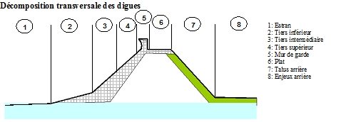

Tutoriel
========

Librairies osgeo nécessaires 
-----------------------------

.... 

   This is the caption of the figure (a simple paragraph).

   
Installation dans Qgis 
-----------------------